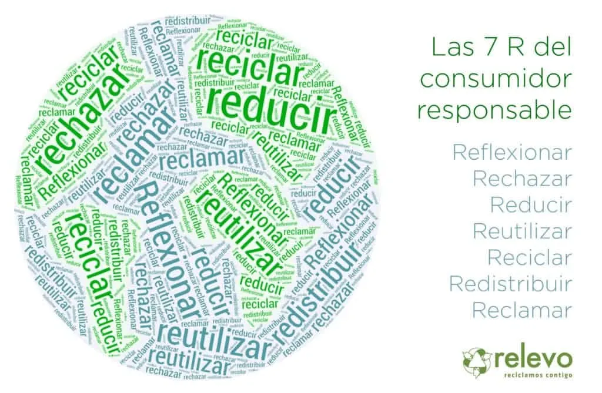

<html lang="es">
<head>
  <meta charset="UTF-8">
  <title>¿Qué son Las 7R's?</title>
</head>

<body style="background-color: rgb(144, 238, 144);">

  <h1 style="color: #000080; font-size: 50px; text-align: center;">
    Las 7R's Aplicadas en mi Comunidad
  </h1>

  <h1><em>¿Qué son las 7Rs?</em></h1>

  <h2 style="font-style: italic; font-family: Georgia, serif; color: #2E8B57; margin-top: 10px;">
    Las 7R's son una evolución de las famosas 3R (Reducir, Reutilizar, Reciclar) y representan principios ecológicos para un estilo de vida más sostenible.
  </h2>

  

  <h2>
    Dentro de este programa, la Oficina Verde de la Universidad de Burgos (UBUverde) presenta esta Conferencia Ambiental presencial y online:
    <strong>“Las siete R básicas de la Economía Circular: rediseñar, reducir, reutilizar, reparar, renovar, recuperar y reciclar”</strong>,
    en cuyo recorrido nos acompañará el ponente Luis Marcos, profesor e investigador de la Universidad de Burgos (UBU), en la cual dirige su Oficina Verde (UBUverde),
    centrando su labor docente e investigadora en temas vinculados al Medio Ambiente y la Nueva Ruralidad; un auténtico convencido del poder que la Economía Circular
    tiene para frenar el agotamiento de materias primas, el despilfarro energético y la generación incontrolable de todo tipo de residuos.
  </h2>

  

    

  <video src="video.mp4" width="360" height="340" controls></video>

     

  <!-- Botón para regresar a la página principal -->
  

    <a href="https://aureliocasa.github.io/importancia7rs/" 
       style="display: inline-block; background-color: #4CAF50; color: white; 
              padding: 10px 20px; text-decoration: none; border-radius: 5px; font-size: 16px;">
      Regresar a la principal
    </a>
  

</body>
</html>
